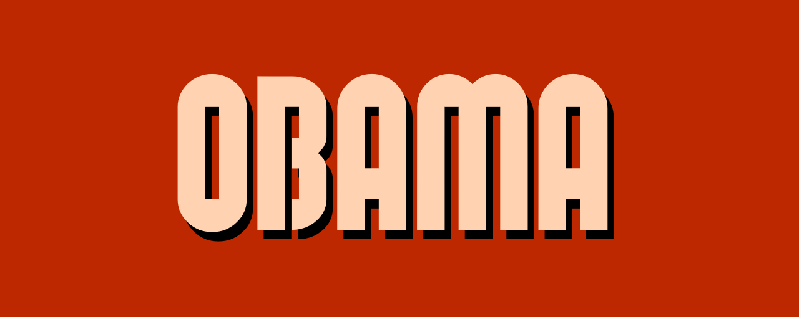

Obama is a Mario engine created by one guy. Obama is the working title for this Mario engine. There is little to no real code quality control here, pull requests and issues are apprecitated!

Planned features:
-Custom level support
-Custom tileset support
-Easy modding

Note for modders: this game will not use classes but will instead use a level megatable, that will store everything because classes are not natively in Lua and have been a pain for me. Sorry.
